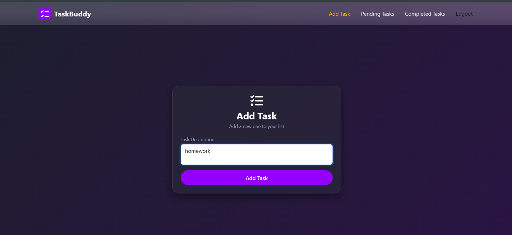

# 📝 Task Management Web Application

This is a comprehensive **Task Management System** that empowers users to efficiently organize their tasks.  
This full-stack application combines the robustness of **Spring Boot** on the backend, the responsiveness of **React.js** on the frontend, and the reliability of **MySQL** as the database.

---

## 🚀 Features

### 👤 User Authentication
Users can register and log in to access the system securely.  
Authentication ensures that only authorized users can perform operations.

### ✅ Task Operations
- **Add Tasks:** Users can effortlessly add new tasks to the system.  
- **View Tasks:** A user-friendly interface displays all tasks for quick and easy reference.  
- **Edit Tasks:** Users have the flexibility to modify task details as needed.  
- **Delete Tasks:** Unwanted tasks can be removed to keep the task list organized.  
- **Mark as Complete:** Users can mark tasks as complete for effective progress tracking.

---

## 🧰 Tech Stack

**Client:** React, ViteJS, Bootstrap  
**Server:** Java, Spring Boot  
**Database:** MySQL  

---

## 🏗️ Architecture

The Task Management System follows a **client-server architecture**, with:
- A **backend** built using Java and Spring Boot serving as the server-side application.  
- A **frontend** developed using React, providing a responsive and dynamic user interface.  
- A **MySQL database** used to store all task-related data.

---

## 📦 Modules

- **Backend:** Contains the Java and Spring Boot application responsible for handling business logic and database operations.  
- **Frontend:** Includes the React application responsible for providing a user interface for interacting with the system.  
- **Database:** Contains the MySQL database schema and scripts for creating and managing the database.

---

## 🗃️ Database Setup (MySQL)

1. Open **MySQL Command Line** or **MySQL Workbench**.
2. Create a new database:
   ```sql
   CREATE DATABASE task_management;
   ```
3. Note your credentials:
   ```yaml
   username: root
   password: 1234
   ```

---

## 🖥️ Backend Setup (Spring Boot)

### 1. Navigate to the backend folder
```bash
cd backend
```

### 2. Open `src/main/resources/application.properties` and configure your database
```properties
spring.datasource.url=jdbc:mysql://localhost:3306/task_management
spring.datasource.username=root
spring.datasource.password=1234
spring.jpa.hibernate.ddl-auto=update
spring.jpa.show-sql=true
spring.jpa.properties.hibernate.dialect=org.hibernate.dialect.MySQL8Dialect
```

### 3. Build the project
```bash
mvn clean install
```

### 4. Run the application
```bash
mvn spring-boot:run
```

**or**

```bash
java -jar target/taskbuddy-0.0.1-SNAPSHOT.jar
```

✅ **Backend runs on:** [http://localhost:8080](http://localhost:8080)

---

## 💻 Frontend Setup (React + Vite)

### 1. Navigate to the frontend directory
```bash
cd frontend
```

### 2. Install dependencies
```bash
npm install
```

### 3. Check API endpoint in your API service file (e.g., `TaskApiService.js`)
```javascript
const BASE_URL = "http://localhost:8080/api";
```

### 4. Run the React app
```bash
npm run dev
```

✅ **Frontend runs on:** [http://localhost:3000](http://localhost:3000)

---

## 🔗 Access the Application

Open your browser and visit:  
👉 **[http://localhost:3000](http://localhost:3000)**  

You can now **register**, **log in**, and **manage your tasks**!

---
## 📸 Application Screenshots

### 🏠 Home Page


### 📝 Add Task


### ✅ Task Dashboard


### 🔐 Login Page


---

## 🧩 Summary

| Component | Command | URL |
|------------|----------|-----|
| **Backend (Spring Boot)** | `mvn spring-boot:run` | [http://localhost:8080](http://localhost:8080) |
| **Frontend (React)** | `npm run dev` | [http://localhost:3000](http://localhost:3000) |
| **Database (MySQL)** | — | `localhost:3306/task_management` |

---
